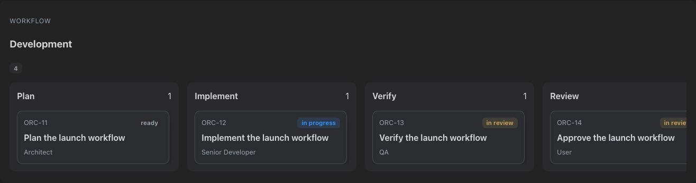
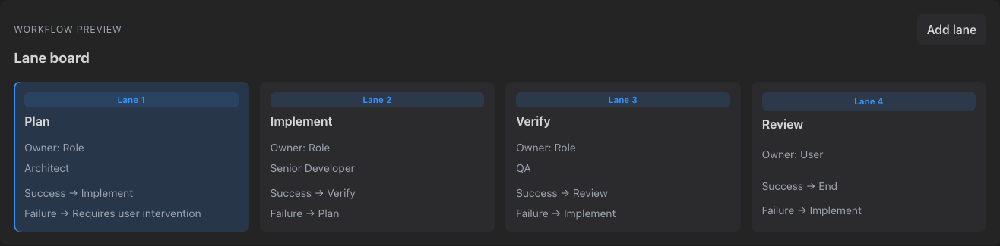
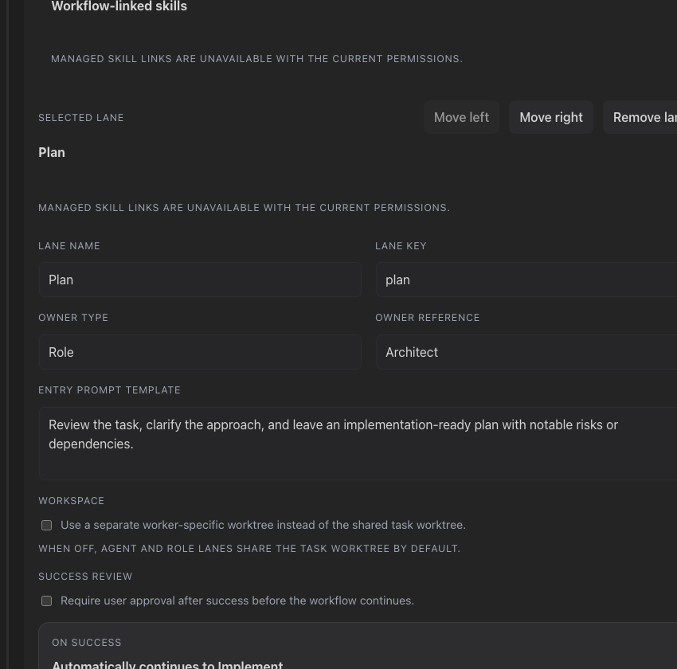
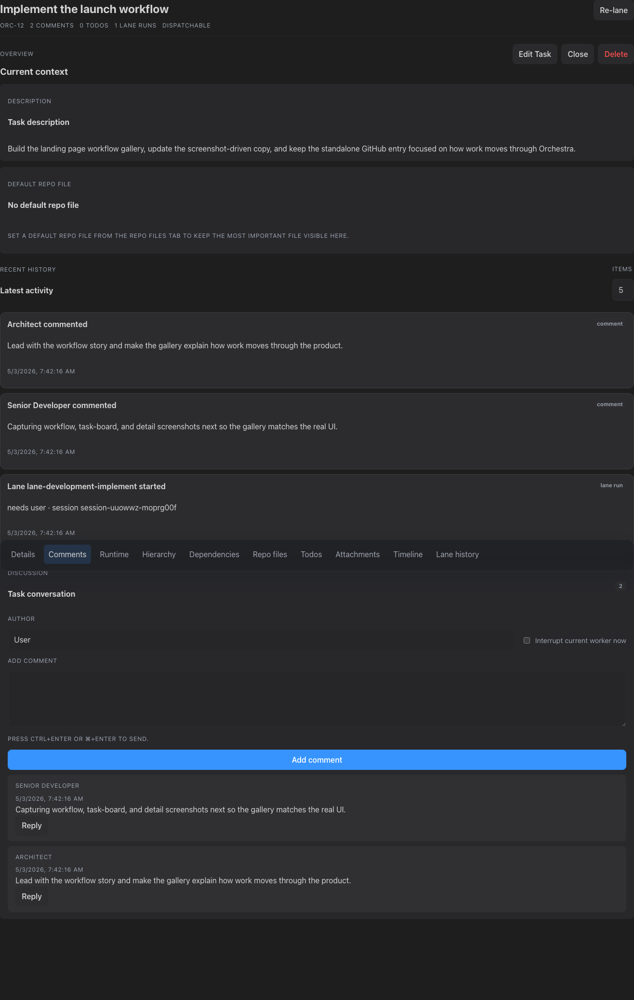
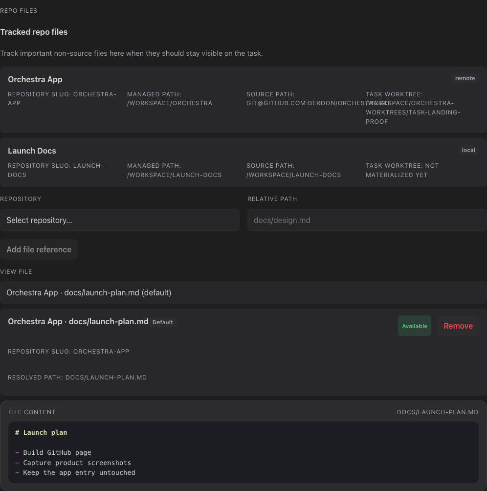
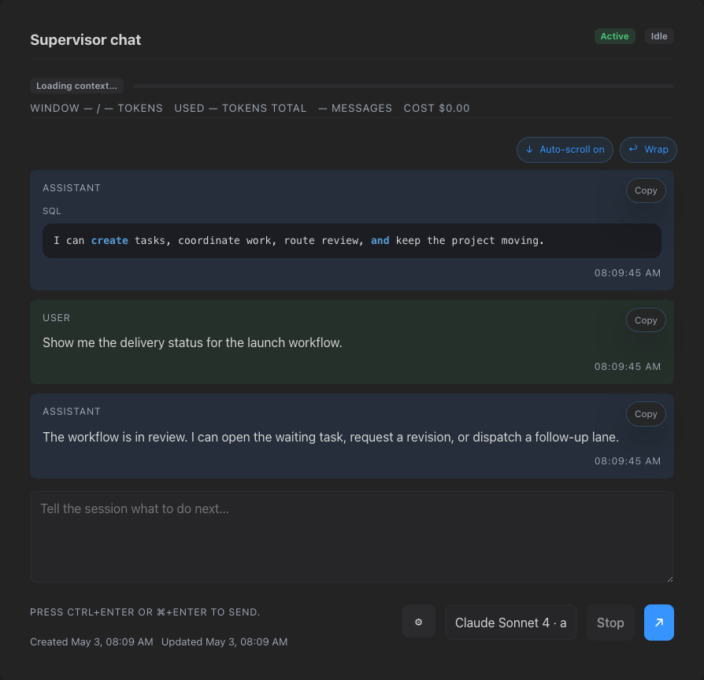
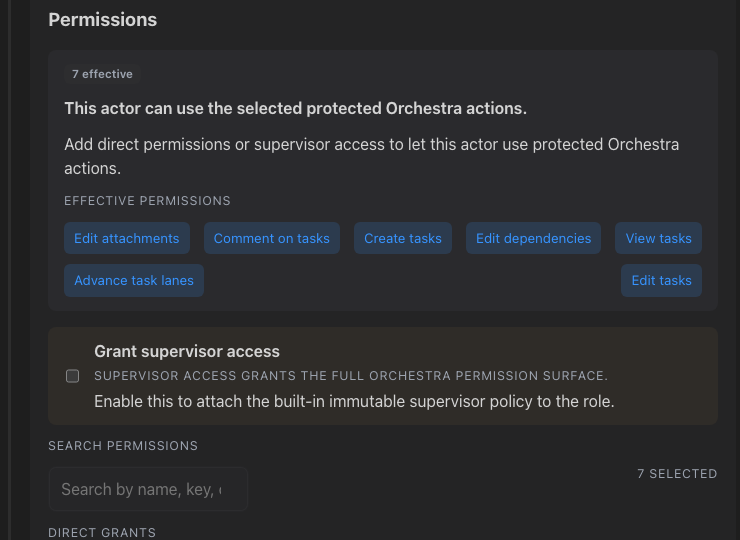
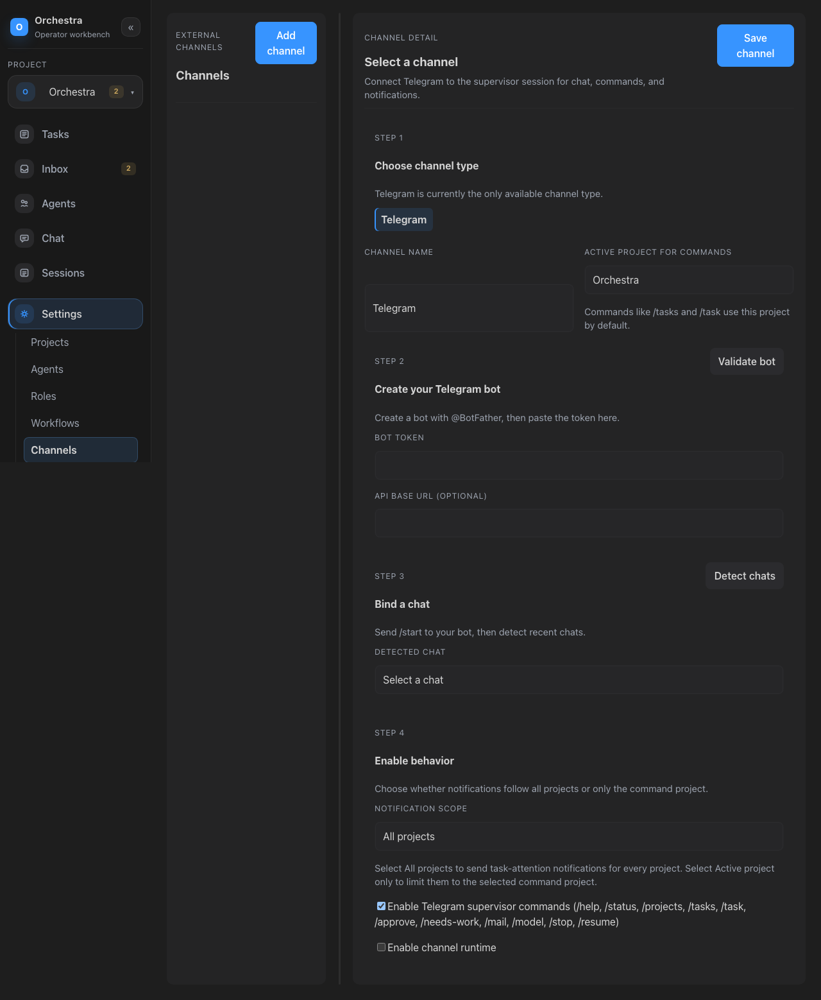
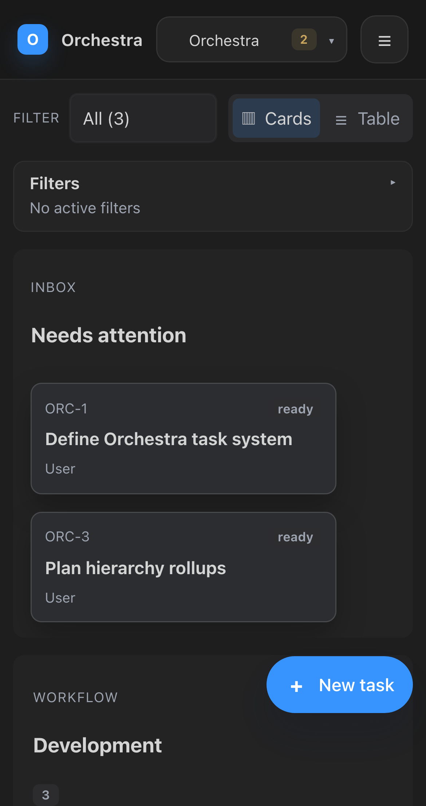
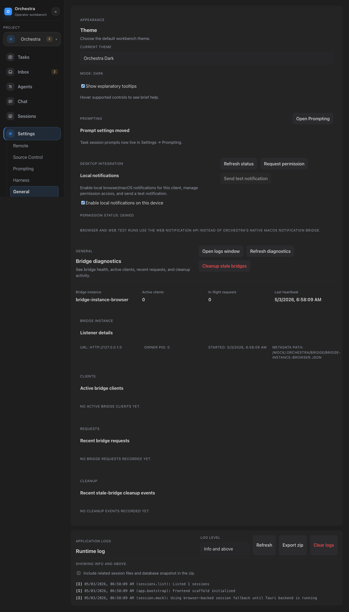

# Orchestra

<p align="center">
  <a href="https://berdon.github.io/orchestra/"><strong>GitHub Page</strong></a>
  &nbsp;•&nbsp;
  <a href="https://hnsn.io/Orchestra_0.1.0_aarch64.dmg"><strong>Download Orchestra for macOS</strong></a>
</p>

Orchestra is an agent orchestration workbench for running real project work.

It brings together **tasks, workflows, repositories, worktrees, agents, role-based workers, sessions, permissions, and human oversight** in one system so teams can coordinate delivery instead of juggling chat threads, issue trackers, and ad hoc scripts.

Orchestra is built for people who want more than a ticket board and more control than a generic chat UI.

<p align="center">
  
</p>

## Why Orchestra

Use Orchestra when you want to:

- run work through **custom workflows** instead of a fixed pipeline
- keep **tasks, repo context, and execution state** connected
- coordinate **persistent agents** and **disposable role-owned work**
- keep a **human supervisor in control** through natural-language commands
- manage orchestration across **desktop, mobile, Telegram, and CLI**

## Screenshots

### Workflow orchestration

<p>
  
  
</p>

Design lane structure, ownership, transitions, approvals, and worktree behavior directly in the workflow.

### Task flow and context

<p>
  
  
</p>

<p>
  
  
</p>

Keep the board, task detail, repository state, worktrees, and live supervisor control in one place.

### Permissions, chat ops, and mobile

<p>
  
  
</p>

<p>
  
  
</p>

Extend orchestration beyond the desktop with granular permissions, Telegram integration, mobile access, and theme customization.

## Getting started

### Current status

Orchestra is a Tauri + React desktop app under active development.

Today, the main way to use it is to run it locally from source.

### Prerequisites

- Node.js / npm
- Rust
- Tauri CLI

```bash
cargo install tauri-cli
```

### Install and run

```bash
npm install
source "$HOME/.cargo/env"
cargo tauri dev
```

Frontend-only development is also available:

```bash
npm run dev
```

### First run

A fresh Orchestra install seeds a baseline workspace with:

- one starter project: `Orchestra`
- standard roles: Architect, Senior Developer, QA, Product Owner, Project Manager
- starter workflows for Product Strategy, Planning, and Development

## Features

### Workflow orchestration

- Fully customizable kanban-style workflows
- Flexible lane structures and transition paths
- Lane ownership by user, role, or agent
- Approval gates and human intervention states
- Workflow-native worktree and execution rules

### Task management

- Workflow-aware task board and task detail views
- Task comments and review loops
- Task dependencies and subtasks
- Attachments, file references, and task-linked context
- Lane movement, pause/resume, approval, and needs-work flows

### Projects, repos, and execution context

- Multiple repositories per project
- Task-linked repository context
- Native task-scoped worktrees
- Visible repo/file context while work is in flight
- Project-scoped storage and session management

### Agents, roles, and sessions

- Persistent supervisor and agent sessions
- Disposable role-owned runtime sessions for parallel work
- Natural-language supervisor control
- Session history, resume flows, and runtime visibility
- Agent-to-agent coordination across related work

### Permissions and governance

- Granular permission model
- Protected actions for sensitive operations
- Supervisor-level access when explicitly granted
- Auditable, visible control surfaces instead of hidden automation

### Operator surfaces

- Desktop workbench
- Mobile client support
- Telegram orchestration and notifications
- Hosted web / remote access support
- `orc` CLI for task and chat operations

### Customization and platform foundations

- Built on Pi
- Support for local or cloud models
- Themes and workbench customization
- Extension and skill-oriented architecture
- Secure project secret support

## Development

### Quick commands

Install dependencies:

```bash
npm install
```

Run the frontend:

```bash
npm run dev
```

`npm run test:coverage` writes terminal, HTML, `json-summary`, and `lcov` reports to `coverage/vitest/`.
`npm run test:ui:matrix` validates the critical-journey UI coverage matrix in `tests/ui-coverage-matrix.json` and enforces the >=90% UI threshold.

### Release guardrails

Before distributing an adhoc build, run the verified guardrail flow:

```bash
npm run build:adhoc:verified
```

That command runs:
- `gitleaks` against the current source tree
- `gitleaks` against reachable git history
- the repo-local machine-reference scanner for usernames and concrete local paths
- a sanitized release-mode adhoc bundle build with Rust path remapping enabled
- a post-build artifact scan over the built app/resources using extracted text plus `strings`

If `gitleaks` is not already installed, the wrapper script will download the repo-pinned version into `.tmp/tools/gitleaks/` for repeatable local use.

For individual checks, use:

```bash
npm run scan:secrets
npm run scan:history
npm run scan:machine-refs
npm run scan:artifacts
npm run scan:artifacts:release
```

To audit specific local usernames without committing them, set `ORCHESTRA_MACHINE_REFERENCE_SEED_USERNAMES` for the scan invocation, for example:

```bash
ORCHESTRA_MACHINE_REFERENCE_SEED_USERNAMES=alice,bob npm run scan:machine-refs
```

### E2E policy

The supported E2E runner is Podman. The checked-in supported inventory lives in `tests/e2e-suite.json`, and `npm run test:e2e` now fans the full supported suite through Podman-backed harness wrappers.

Supported commands:

```bash
npm run test:e2e
npm run test:e2e:desktop
npm run test:e2e:browser
npm run test:e2e:hosted-web
npm run test:e2e:web-driver
```

The umbrella runner also accepts explicit spec paths and routes them to the right harness, for example:

```bash
npm run test:e2e -- tests/e2e/inbox.spec.ts tests/hosted-web-e2e/inbox.spec.ts
```

For desktop-only Podman subsets, you can still call the lower-level wrappers directly:

```bash
./scripts/run-desktop-e2e-podman.sh tests/desktop-e2e/<spec>.test.ts
./scripts/run-desktop-e2e-suite-podman.sh tests/desktop-e2e/<spec-a>.test.ts tests/desktop-e2e/<spec-b>.test.ts
```

To fan the Podman suite out across harnesses, set `E2E_JOBS`. To fan the desktop subset out internally, set `DESKTOP_E2E_JOBS`:

```bash
E2E_JOBS=4 npm run test:e2e
DESKTOP_E2E_JOBS=2 npm run test:e2e:desktop
```

If you need direct host-local debugging, use the explicit `:local` aliases instead of the supported Podman commands:

```bash
npm run test:e2e:browser:local -- --grep "projects"
npm run test:e2e:hosted-web:local
npm run test:e2e:web-driver:local
npm run test:e2e:desktop:local
```

On macOS, first-time Podman setup may also require:

```bash
brew install podman
/usr/sbin/softwareupdate --install-rosetta --agree-to-license
podman machine init
podman machine set --memory 8192 podman-machine-default
podman machine start
```

### Tauri desktop app

The repository includes a `src-tauri/` scaffold and matching session command surface, but building/running the desktop app requires a Rust toolchain and Tauri system prerequisites to be installed locally.

### `orc` CLI

The Rust backend also ships an `orc` CLI under `src-tauri/src/bin/orc.rs`.

Current command surface:

```bash
orc [--orchestra-home <path>] chat [--agent <agent>]
orc [--orchestra-home <path>] msg [--agent <agent>] <message...>
orc [--orchestra-home <path>] [--project <project>] task list [--json]
orc [--orchestra-home <path>] [--project <project>] task show <task> [--json]
orc [--orchestra-home <path>] [--project <project>] task create --title <title> [...flags] [--json]
orc [--orchestra-home <path>] [--project <project>] task update <task> [...flags] [--json]
orc [--orchestra-home <path>] [--project <project>] task comment <task> <message...> [--reply-to <comment-id>] [--interrupt] [--json]
orc [--orchestra-home <path>] [--project <project>] task comments <task> [--json]
orc [--orchestra-home <path>] [--project <project>] task approve <task> [--json]
orc [--orchestra-home <path>] [--project <project>] task needs-work <task> [--notes <text>] [--json]
orc [--orchestra-home <path>] [--project <project>] task pause <task> [--notes <text>] [--json]
orc [--orchestra-home <path>] [--project <project>] task resume <task> [--notes <text>] [--json]
orc [--orchestra-home <path>] [--project <project>] task stop <task> [--notes <text>] [--json]
orc [--orchestra-home <path>] [--project <project>] task dispatch <task> [--json]
orc [--orchestra-home <path>] [--project <project>] task move <task> --lane <lane-id> [--notes <text>] [--json]
```

Task selectors accept canonical ids, task numbers like `ORC-67`, and numeric shorthand like `67` when a selected/default project makes the reference unambiguous. Human-readable text is the default output mode; pass `--json` for structured scripting output. Use `--orchestra-home <path>` when you want the CLI to read/write a different Orchestra storage root than the default `~/.orchestra`; the value should be the final storage root itself (for example `~/.orchestra-dev`).

#### Prerequisites

- Rust toolchain (`cargo install tauri-cli`)
- macOS: Xcode Command Line Tools (`xcode-select --install`)

#### Running the dev app

```bash
source "$HOME/.cargo/env"
cargo tauri dev
```

Run tests:

```bash
npm test
npm run verify
```

### Developer docs

The previous README has been moved to [dev-readme.md](dev-readme.md) and contains the more detailed development guide, including:

- coverage and verification commands
- desktop E2E policy
- adhoc signing and release guardrails
- mobile harness details
- remote access notes
- deeper CLI and build information

## Documentation

- [dev-readme.md](dev-readme.md)
- [docs/implementation-plan.md](docs/implementation-plan.md)
- [docs/ux-north-star.md](docs/ux-north-star.md)
- [docs/authorization-model.md](docs/authorization-model.md)
- [docs/session-storage.md](docs/session-storage.md)
- [docs/adhoc-signing.md](docs/adhoc-signing.md)
